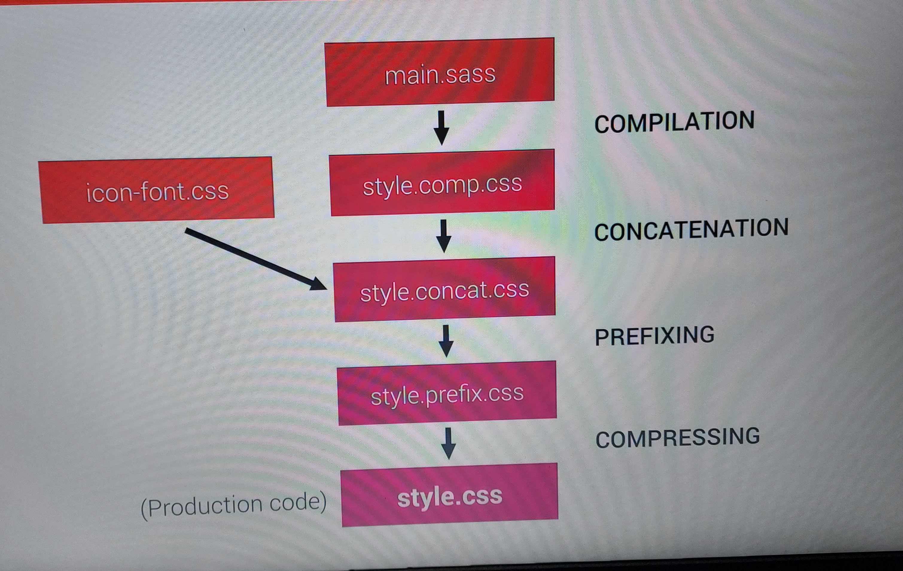
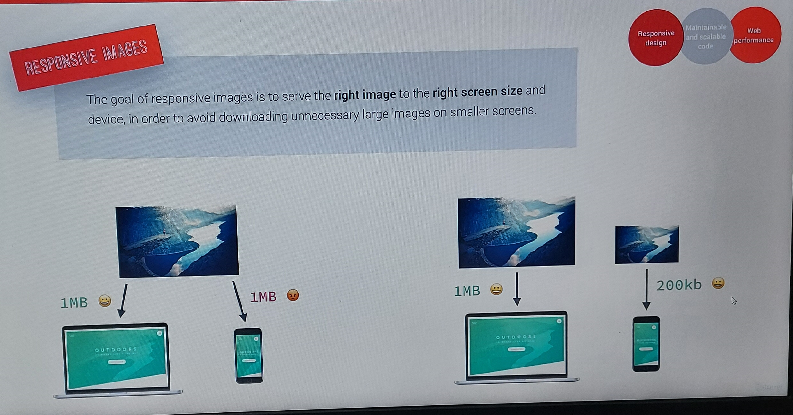

## Sass project

Here I have used scss syntax instead of sass.

-> sass syntax and scss syntax

sass syntax does not contain curly braces and semi-colon
whereas scss syntax does contain them.

eg. sass syntax

.navigation
list-style: none
float: left

    scss syntax

.navigation {
list-style: none
float: left
}

-> for basics of sass
https://codepen.io/thedikshagrover/pen/mdpEEPK?editors=1100

commands used:

-> npm install live-server -g
to install live-server package globally

-> live-server
this command will detect changes that happened in our project

-> npm init
to add package.json file

-> npm install node-sass --save-dev
it will add all the dependencies and node-sass is a tool to develop our project

-> npm run compile:sass
in package.json file:
"compile:sass": "node-sass sass/main.scss css/style.comp.css",

- sass/main.scss this file is the input file which has scss and we wanna convert it into css

- css/style.comp.css file is the output file where we want the converted css

-> npm install concat --save-dev

-> npm run concat:css

-> npm install autoprefixer --save-dev

-> to make the autoprefixer to work
npm install postcss-cli --save-dev

-> npm run prefix:css

-> npm run compress:css

-> npm-run-all --save-dev

-> npm run build:css

New Things learnt by this udemy course:

1. navigation
2. popup
3. 7-1 pattern
4. BEM
5. live-server command
   and many more small concepts
6. how to calculate vw, w and max-width(max-width in em)
   video 62(responsive images of HTML- density resolution switching) of udemy course

===============================================================

Build process

 
normally we compile the code while we write the code. 
1. So in first step we compile the main.sass file to css file to style.comp.css 
2. Then we concatenate the compiled style.comp.css file and the css file to style.concat.css 
with having one file we have to generate only one HTTP requeat    
3. Then the file for th prefixes are added which is style.prefix.css  
prefixes like -webkit-  
4. At last step entire code is compressed to style.css
 
Breakout-points
 

 
Responsive-image
 

 
==========================================================

for flexbox

https://codepen.io/thedikshagrover/pen/JjMORqQ?editors=1100

What is sass?

SASS

-> Sass is an extension of CSS
-> to compile sass, there is a need of compiler called npm
-> the probelm with css is that it can get really messy.
it becomes difficult to manage css after sometime
-> sass provides us with a couple of handy features and tools
-> so we write sass code in sass files 
then we run a complier 
this compiler converts sass into regular css code

=================================================

features of sass

-> variables: these variables are just like other programming languages.
we use them for reusbale values such as  colors, font-sizes etc

-> nesting: we can nest selectors to write less code
 
-> operators: we can use operators for mathematical operations inside css

-> partials and imports: to write css in different files and importing them all into one single file

-> mixins: to write reuseable pieces of css code

-> functions: similar to mixins, with the  difference that they produce a value that can than be used

-> extends: to make different selectors inherit declarations that are common to all of them

-> control directives: for writing complex code using conditionals and loops 

====================================================================================================================

sass syntax and scss syntax

sass syntax does not contain curly braces and semi-colon
whereas scss syntax does contain them.

eg. sass syntax

.navigation 
   list-style: none
   float: left

	scss syntax
.navigation {
   list-style: none
   float: left
}

==============================================================================

variable

variable is basically a container where we can store data.

===============================================================================================================================================

nodeJS and npm

nodeJS allows developers to write and run javascript applications on the server.
nodeJS also helps to write with local web development

npm is a simple command line interface that allows developers to install and manage packages.
There are lot of open-source tools , libraries and frameworks that npm offers.

=====================================================================================================================================================

to make css responsive

-> use % or vh or vw unit for the viewport instead of px

-> use rem unit instead of ox for lenghts

-> images don't scale automatically if we change the viewport so need to fix that.
We can use % for image dimensions and max-width property.
what max-width means is that- 
eg: max-width: 114rem;
so if we have the space of 114 rem then it will take 114rem.
but if we have less space then it will take 100% of space  that is available

-> we can use media queries for different viewport widths

======================================================================================================

layout types

-> float layouts
float layouts are getting outdated 

-> flexbox
use when we need 1-dimensional row or column 

-> grid
use when we need 2-dimensional grid 

